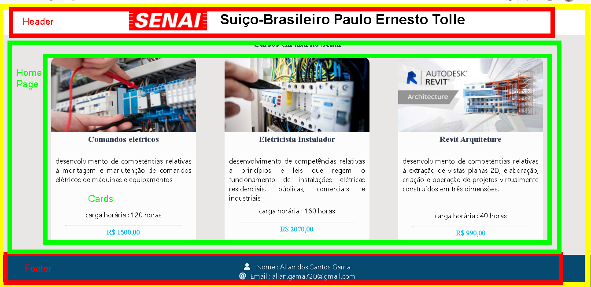

# WebPage-CursosSenai-ReactJs
Página web que demonstra cursos oferecidos pelo Senai. Esta página foi construída com React.js

## Tecnologias
      

## Objetivo

A Página demonstra alguns cursos ,bem como suas respectivas informações, dispostos em cards. 

- confira o wireframe que guiou a elaboração do layout desta página : [wireframe](./Wireframe.png)
(Este Wireframe foi feito com Draw.io : [confira](https://drawio-app.com/))
- confira o layout final : [layout final](./Layoutfinal.png)

## React
O React é uma biblioteca javascript para construção de **interface do usuário** (UI). O principal conceito dessa framework são os **componentes** : partes que formam a interface. Em nosso projeto os seguintes componentes estão presentes :

- App (zona Amarela)
- Header (Zona Vermelha)
- Home Page (Zona Verde)
- Cards (Zona Verde)
- Footer (Zona Vermelha)

 App (representado em amarelo) é o componentes pai dos componentes Header, Home Page e Footer e o componente Home Page é pai do componente Cards.
 
 
 Esse Diagrama representa o parentesco entre os componentes
 .png)
 
 
